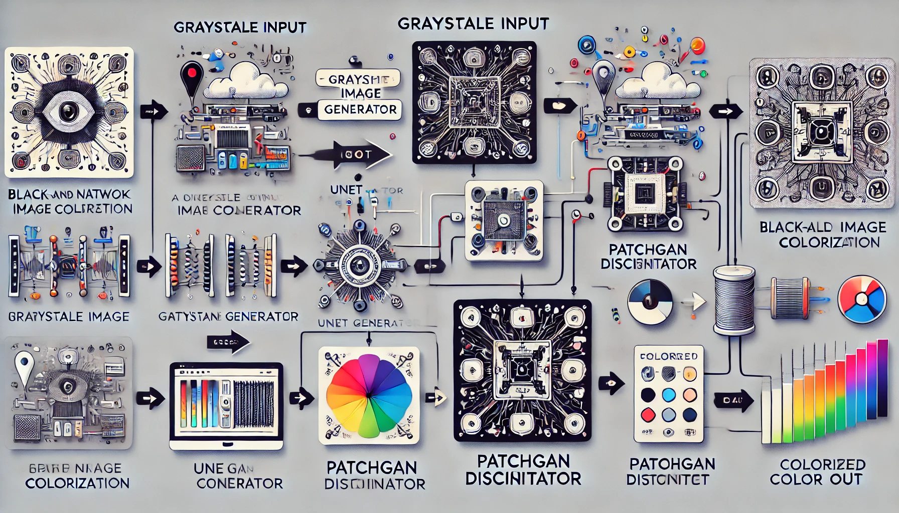
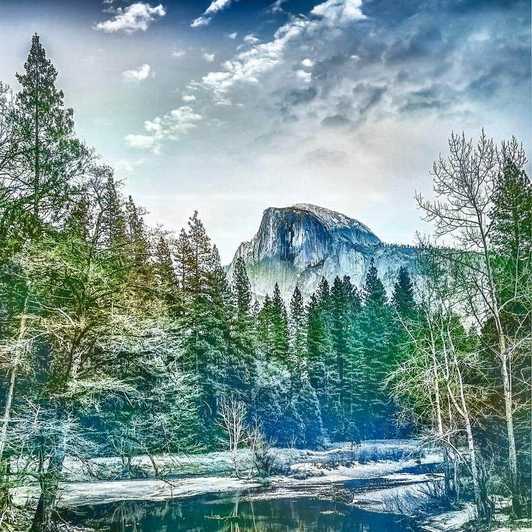

# AI Image Colorizer 🎨

Colorize black & white images using deep learning (GAN) and traditional computer vision (LAB) methods.

  
  
   <!-- Add your demo image path -->

## Features ✨
- **Dual Colorization Modes**
  - 🧠 **GAN v70**: Deep Learning with U-Net Architecture
  - 🎨 **LAB**: Traditional Color Space Manipulation
- **Real-Time Adjustments**
  - GAN: Contrast (0.5-3.0) & Saturation (0.0-2.0)
  - LAB: Brightness (-50 to +50)
- **High-Quality Output**
- **One-Click Download**

## Installation 🛠️

### Prerequisites
- Python 3.8+
- pip package manager

```bash
# Clone repository
git clone https://github.com/yourusername/ai-image-colorizer.git
cd ai-image-colorizer

# Install dependencies
pip install -r requirements.txt
```

### Model Setup
1. **GAN Model**  
   Place `colorization_gan_70.pth` in:
   ```
   gan/model/colorization_gan_70.pth
   ```

2. **LAB Model** (Optional)  
   Download from [Rich Zhang's Colorization](https://github.com/richzhang/colorization) and place in:
   ```
   lab/model/
   ├── colorization_deploy_v2.prototxt
   ├── colorization_release_v2.caffemodel
   └── pts_in_hull.npy
   ```

## Usage 🖥️

```bash
# Start application
streamlit run app.py
```

**Step-by-Step Guide:**
1. Upload B&W image (JPG/PNG)
2. Select model type:
   - GAN: For neural network colorization
   - LAB: For traditional CV approach
3. Adjust parameters using sidebar sliders
4. Click "✨ Colorize" button
5. Download result using "💾 Download" button

## Project Structure 📂
```
.
├── app.py                # Main application
├── requirements.txt      # Dependency list
├── README.md             # This documentation
├── gan/                  # GAN implementation
│   ├── __init__.py
│   ├── colorize.py       # Processing pipeline
│   ├── gan_model.py      # U-Net architecture
│   └── model/            # Pretrained weights
└── lab/                  # LAB implementation
    ├── __init__.py
    ├── colorize.py       # CV processing
    └── model/            # Caffe models
```

## Troubleshooting ⚠️

**Common Issues:**
1. **Model File Not Found**
   ```bash
   FileNotFoundError: GAN model 70 not found at: ...
   ```
   - Verify file exists at `gan/model/colorization_gan_70.pth`

2. **Dependency Conflicts**
   ```bash
   pip install --upgrade -r requirements.txt
   ```

3. **CUDA Out of Memory**
   - Reduce input image size
   - Use CPU-only mode in `gan/colorize.py`:
     ```python
     device = torch.device("cpu")  # Force CPU usage
     ```

## System Requirements 💻
| Component | Minimum | Recommended |
|-----------|---------|-------------|
| RAM       | 4GB     | 8GB+        |
| Storage   | 2GB     | 5GB         |
| GPU       | CPU     | NVIDIA GPU  |

## License 📄
MIT License - See [LICENSE](LICENSE) file


**Note:** Torch path warnings (`__path__._path`) are normal and can be safely ignored.
